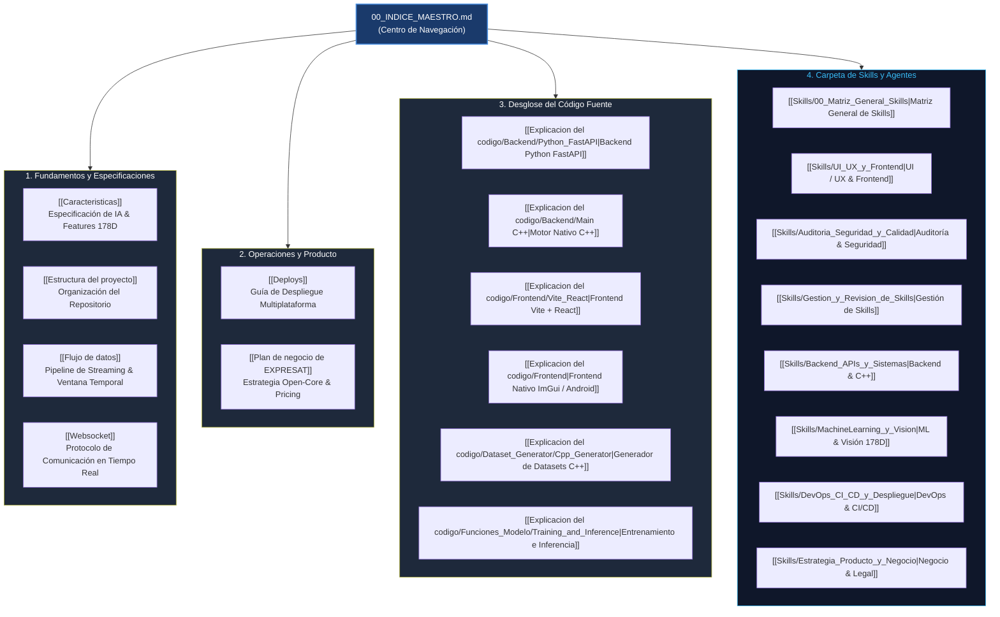

# 🌐 Índice Maestro de Arquitectura y Documentación — ExpresaT

Bienvenido a la base de conocimiento y documentación técnica de **ExpresaT**, la plataforma de traducción automática de Lengua de Señas a texto y voz en tiempo real con inteligencia artificial ligera optimizada para ejecución en hardware convencional (CPU).

Este repositorio de documentación (Obsidian Vault) está estructurado siguiendo los más altos estándares de ingeniería de software para ser navegado con máxima precisión tanto por **ingenieros humanos** como por **agentes de Inteligencia Artificial autónomos**.

---

## 🗺️ Mapa de Navegación del Sistema

---

## 📚 Matriz de Documentos del Proyecto

| Documento | Audiencia Principal | Propósito Técnico | Skills Sugeridas |
|---|---|---|---|
| **[[Caracteristicas]]** | ML Engineers, Backend Devs | Especificación del vector de 178 características, normalización respecto a hombros, arquitectura PyTorch `SignLanguageGRU` y cuantización INT8. | `ml-engineer`, `mlops-engineer` |
| **[[Estructura del proyecto]]** | Todos los desarrolladores y agentes | Descripción exhaustiva del árbol de directorios, roles de cada carpeta, dependencias y enlaces entre módulos. | `c4-architecture-c4-architecture`, `dx-optimizer` |
| **[[Flujo de datos]]** | Arquitectos, Agentes de streaming | Diagrama de flujo de datos extremo a extremo (cámara → MediaPipe → buffer 15 frames → WebSocket / IPC → ONNX Runtime → UI). | `microservices-patterns`, `async-python-patterns` |
| **[[Websocket]]** | Backend Devs, Agentes de Red | Especificación completa del protocolo WebSocket (Batch mode vs Stream mode), payloads JSON, autenticación Supabase y keep-alive. | `fastapi-pro`, `backend-security-coder` |
| **[[Deploys]]** | DevOps, Cloud Engineers | Runbook para despliegues en Docker (FastAPI), Netlify (Vite React), Supabase (PostgreSQL/Auth) y binarios nativos (CMake/Android). | `deployment-pipeline-design`, `github-actions-templates` |
| **[[Plan de negocio de EXPRESAT]]** | Product Managers, Founders | Estrategia de producto Open-Core, análisis de mercado TAM/SAM/SOM, modelo de suscripción (50-600 MXN) y costes de inferencia. | `startup-business-analyst-business-case`, `competitive-landscape` |
| **[[Skills/00_Matriz_General_Skills]]** | Agentes Autónomos | Catálogo maestro y carpetas de habilidades instaladas en el entorno local (`~/.gemini/config/skills/`). | `antigravity-skills-manager`, `agent-orchestration-improve-agent` |

---

## 💻 Desglose Técnico por Componente de Código

### 1. Generador de Datasets en C++ (`expresat-dataset-generator`)
- **Resumen:** [[Explicacion del codigo/Dataset_Generator/Cpp_Generator]]
- **Compilación y CMake:** [[Explicacion del codigo/Dataset_Generator/01_Arquitectura_y_Compilacion]]
- **Normalización 178D y Landmarks:** [[Explicacion del codigo/Dataset_Generator/02_Extraccion_y_Normalizacion]]
- **Aumentación Estocástica de Datos:** [[Explicacion del codigo/Dataset_Generator/03_Motor_Aumentacion_Sintetica]]
- **Interfaz Gráfica Dear ImGui:** [[Explicacion del codigo/Dataset_Generator/04_Interfaz_Grafica_ImGui]]
- **Serialización JSON y CI/CD:** [[Explicacion del codigo/Dataset_Generator/05_Serializacion_JSON_y_CICD]]

### 2. Frontend (Web y Nativo)
- **Visión General Nativa:** [[Explicacion del codigo/Frontend]]
- **Frontend Moderno (React + Vite):** [[Explicacion del codigo/Frontend/Vite_React]]
- **Frontend Clásico (Vanilla JS):** [[Explicacion del codigo/Frontend/Legacy_Vanilla]]

### 3. Backend e Inferencia
- **Servidor Python (FastAPI):** [[Explicacion del codigo/Backend/Python_FastAPI]]
- **Motor C++ de Inferencia Nativa:** [[Explicacion del codigo/Backend/Main C++]]
- **Pipeline de Entrenamiento y Exportación:** [[Explicacion del codigo/Funciones_Modelo/ENTRENO Y EXPORTACION]]
- **Motor de Inferencia ONNX Runtime:** [[Explicacion del codigo/Funciones_Modelo/INFERENCIA]]
- **Resumen Inferencia y Entrenamiento:** [[Explicacion del codigo/Funciones_Modelo/Training_and_Inference]]

---

## 🤖 Guía de Operación para Agentes de Inteligencia Artificial

Si eres un agente de IA operando en este repositorio:
1. **Regla de Contexto:** Antes de modificar un archivo en `expresat/` o `expresat-native/`, lee el documento correspondiente en este Vault.
2. **Invariantes del Sistema:**
   - La red `SignLanguageGRU` espera tensores de entrada de dimensiones exactas `(1, 15, 178)`.
   - La normalización se realiza tomando como origen el centro de los hombros (`(pose[11] + pose[12]) / 2`).
   - El modelo ONNX cuantizado en producción es `expresat_gru_int8.onnx`.
3. **Consulta de Habilidades:** Acude a [[Skills/00_Matriz_General_Skills]] para identificar las habilidades idóneas antes de realizar refactorizaciones o auditorías.
