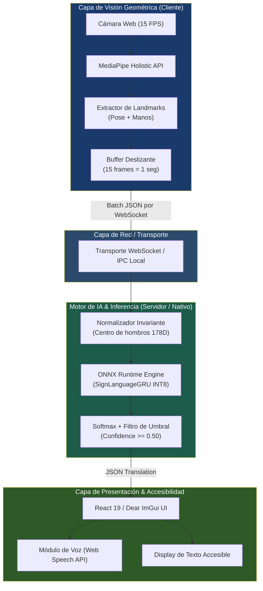

# ⚙️ Especificación Técnica y Arquitectura del Sistema — ExpresaT

> **Navegación:** [[00_INDICE_MAESTRO|🏠 Índice Maestro]] > **Especificaciones y Características**

Este documento define la especificación técnica integral de **ExpresaT**, abarcando la ingeniería de características geométricas, la arquitectura de la red neuronal recurrente, las optimizaciones de cuantización y los componentes de servicio en frontend y backend.

---

## 🏗️ Visión General de la Arquitectura del Sistema

---

## 1. Ingeniería de Características (Feature Engineering 178D)

El modelo prescinde de píxeles brutos de video y opera sobre representaciones geométricas espaciales de 178 dimensiones por fotograma:

| Región Anatómica | Puntos MediaPipe | Coordenadas / Atributos | Total Dimensiones |
|---|---|---|---|
| **Upper Pose** | Índices `0`, `11` a `22` (cabeza, hombros, codos, muñecas) | $x, y, z, \text{visibility}$ (4D) | $13 \times 4 =$ **52** |
| **Mano Izquierda** | Índices `0` a `20` (21 articulaciones completas) | $x, y, z$ (3D) | $21 \times 3 =$ **63** |
| **Mano Derecha** | Índices `0` a `20` (21 articulaciones completas) | $x, y, z$ (3D) | $21 \times 3 =$ **63** |
| **TOTAL** | | | **178 características / frame** |

### Normalización Espacial Invariante
Para que la red reconozca las señas independientemente de si el usuario está sentado, de pie, cerca o lejos del sensor:
1. Se calcula el punto medio entre los hombros (landmarks 11 y 12).
2. Se traslada el origen de coordenadas al centro de los hombros.
3. Se escala dividiendo por la distancia euclidiana inter-humeral.

---

## 2. Arquitectura de la Red Neuronal (`SignLanguageGRU`)

- **Modelo:** `SignLanguageGRU` (definido en PyTorch y exportado a ONNX).
- **Forma de Entrada:** Tensor de dimensiones `(batch_size, 15, 178)` correspondiente a secuencias de 15 fotogramas temporales.
- **Capa Recurrente:** 1 capa **GRU (Gated Recurrent Unit)** unidireccional con 64 unidades ocultas (`hidden_size = 64`).
- **Cabezal Clasificador (MLP Head):**
  - `Linear(64 -> 32)`
  - `ReLU()`
  - `Dropout(0.3)`
  - `Linear(32 -> num_classes)`
- **Parámetros Totales:** ~12,000 parámetros (peso extremadamente ligero).
- **Justificación de Diseño:** La arquitectura GRU requiere un **25% menos de parámetros** y operaciones en comparación con LSTM, manteniendo idéntica precisión en secuencias cortas (1 segundo a 15 FPS).

### Pipeline de Optimización y Cuantización ONNX
1. Entrenamiento en PyTorch (`train_and_export.py`).
2. Exportación a ONNX estándar con `opset_version = 17`.
3. Cuantización dinámica a precisión **INT8** (`quantize_dynamic` de `onnxruntime.quantization`).
4. **Resultado:** Reducción de tamaño de archivo a tan solo **4 KB de grafo + 193 KB de tabla de datos**, reduciendo el consumo de RAM en más de un 90% y acelerando la inferencia en CPU a tan solo **2.02 ms**.

---

## 3. Servidor Backend (FastAPI + WebSockets)

- **Punto de Entrada:** `expresat/backend/main.py`
- **Gestión de Sesión:** Patrón Singleton para `InferenceEngine` cargado en memoria una sola vez al inicio del ciclo de vida (`lifespan`).
- **Conexiones Concurrentes:** Administradas por la clase `ConnectionManager`.
- **Inferencia No Bloqueante:** La función `run_inference_async` ejecuta la llamada de ONNX Runtime en un hilo desacoplado mediante `asyncio.to_thread` para mantener el bucle de eventos reactivo.
- **Autenticación:** Integración con tokens JWT de Supabase en el handshake del WebSocket.

---

## 4. Frontend Web (React 19 + Vite + MediaPipe.js)

- **Framework:** React 19.2.7 con empaquetador ultra-rápido Vite 8.1.0.
- **Enrutamiento:** React Router 7.
- **Páginas Principales:**
  - `Translator.jsx`: Vista central con streaming de cámara y traducción interactiva.
  - `Home.jsx`: Landing page explicativa.
  - `Auth.jsx`: Login y registro gestionado con Supabase Auth.
  - `Learn.jsx`: Módulo educativo y glosario visual de señas.
- **Arquitectura de Servicios:**
  - `apiService.js`: Manejo de reconexiones y envío de lotes de landmarks por WebSocket.
  - `mediapipeEngine.js`: Inicialización y extracción de puntos geométricos en tiempo real.

---

## 5. Métricas de Desempeño y Benchmark

| Métrica Operativa | Valor Medido | Criterio de Calidad |
|---|---|---|
| Tiempo de Inferencia ONNX (CPU) | **2.02 ms** | Excelente (< 10 ms requerido) |
| Latencia Extremo a Extremo (Web) | **~85 ms** | Percepción instantánea humana |
| Tamaño del Modelo Cuantizado (INT8) | **4 KB** | Distribución ultraligera |
| Consumo de RAM del Backend | **< 100 MB** | Apto para servidores micro / edge |
| Tasa de Cuadros de la Cámara | **15 FPS** | Óptimo para ancho de banda y captura de gestos |
| Ventana Temporal de Análisis | **15 frames (1 segundo)** | Cobertura temporal de señas aisladas |

---

## 🤖 Asignación de Agentes y Skills Recomendadas

- **Para Modificaciones de la Red Neuronal:** Invocar **`ml-engineer`** (en `~/.gemini/config/skills/ml-engineer/`) y consultar [[Skills/MachineLearning_y_Vision]].
- **Para Optimización de Servidor y WebSockets:** Invocar **`fastapi-pro`** (en `~/.gemini/config/skills/fastapi-pro/`) y consultar [[Skills/Backend_APIs_y_Sistemas]].
- **Para Diseño de Componentes UI y Accesibilidad:** Invocar **`ui-ux-designer`** y **`wcag-audit-patterns`** y consultar [[Skills/UI_UX_y_Frontend]].
- **Para Auditorías de Seguridad y Rendimiento:** Invocar **`security-auditor`** y consultar [[Skills/Auditoria_Seguridad_y_Calidad]].