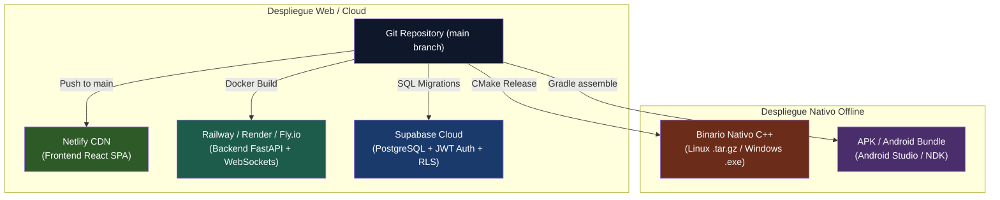

# 🚀 Guía de Despliegue Multiplataforma y Runbook de Operaciones — ExpresaT

> **Navegación:** [[00_INDICE_MAESTRO|🏠 Índice Maestro]] > **Guía de Despliegue (Deploys)**

Este documento contiene las especificaciones y procedimientos de puesta en producción para los distintos componentes del ecosistema **ExpresaT**.

---

## 🏗️ Matriz de Ambientes y Plataformas de Despliegue



---

## 1. Base de Datos y Autenticación (Supabase)

El backend delega la gestión de identidades y almacenamiento relacional a **Supabase** (PostgreSQL gestionado):

### Procedimiento:
1. Crear el proyecto en la consola de [Supabase](https://supabase.com).
2. Ejecutar las migraciones SQL ubicadas en `supabase/migrations/` para generar las tablas de usuarios, configuraciones de accesibilidad e historial de práctica.
3. Habilitar los proveedores de autenticación (Email/Contraseña y proveedores sociales OAuth si aplican).
4. Configurar las variables en el panel del proyecto:
   - `SUPABASE_URL`: Endpoint de la API REST / Auth.
   - `SUPABASE_ANON_KEY`: Clave pública para el frontend React.
   - `SUPABASE_SERVICE_ROLE_KEY`: Clave privada exclusiva para tareas administrativas en backend (¡nunca exponer en el frontend!).

> [!CRITICAL] Seguridad RLS (Row Level Security)
> Es imperativo habilitar políticas RLS (`ALTER TABLE ... ENABLE ROW LEVEL SECURITY;`) en todas las tablas para aislar estrictamente los datos de perfil y aprendizaje entre usuarios.

---

## 2. Servidor Backend (FastAPI + WebSockets)

Dado que la inferencia gestual opera mediante conexiones persistentes por WebSocket, **no debe desplegarse en entornos serverless puros** (como AWS Lambda o Vercel Serverless Functions) que terminan las conexiones tras pocos segundos.

### Plataformas Recomendadas:
- **PaaS para WebSockets:** Railway, Fly.io, Render.
- **IaaS / Contenedores:** AWS EC2, DigitalOcean Droplet, GCP Compute Engine mediante Docker.

### Variables de Entorno de Producción (`.env`):
```env
SUPABASE_URL=https://tu-proyecto.supabase.co
SUPABASE_KEY=tu_supabase_service_role_o_anon_key
MODEL_DIR=./models/exported_model
CONFIDENCE_THRESHOLD=0.50
CORS_ORIGINS=https://expresat.netlify.app,https://expresat.com
PORT=8000
HOST=0.0.0.0
ENVIRONMENT=production
```

### Despliegue con Docker:
```bash
# 1. Construir la imagen optimizada
docker build -t expresat-backend:latest -f expresat/backend/Dockerfile .

# 2. Levantar el contenedor exponiendo el puerto 8000
docker run -d --name expresat-prod \
  -p 8000:8000 \
  --env-file .env \
  --restart unless-stopped \
  expresat-backend:latest
```

### Configuración del Proxy Inverso (Nginx):
Para evitar que proxies intermedios o balanceadores de carga cierren la conexión de WebSocket:
```nginx
location /ws/ {
    proxy_pass http://localhost:8000;
    proxy_http_version 1.1;
    proxy_set_header Upgrade $http_upgrade;
    proxy_set_header Connection "upgrade";
    proxy_read_timeout 3600s;
    proxy_send_timeout 3600s;
}
```

---

## 3. Frontend Web (React 19 + Vite)

El frontend está configurado para despliegue estático con CDN global mediante **Netlify** o **Cloudflare Pages**.

### Especificación de Compilación:
- **Directorio Base:** `expresat/frontend`
- **Comando de Build:** `npm run build`
- **Directorio de Salida:** `dist`
- **Configuración de Redirección:** Provista por `netlify.toml` en la raíz del repositorio para garantizar enrutamiento SPA sin errores 404:
  ```toml
  [[redirects]]
    from = "/*"
    to = "/index.html"
    status = 200
  ```

### Variables de Entorno en el Hosting Frontend:
```env
VITE_API_URL=wss://api.expresat.com/ws/translate
VITE_SUPABASE_URL=https://tu-proyecto.supabase.co
VITE_SUPABASE_ANON_KEY=tu_clave_publica_anonima
```

> [!TIP] Requisito Estricto de HTTPS
> Los navegadores modernos bloquean el acceso al hardware de la cámara (`navigator.mediaDevices.getUserMedia`) si la web no se sirve bajo **HTTPS**. Asimismo, en HTTPS el socket debe ser necesariamente seguro (`wss://`).

---

## 4. Distribución del Modelo de IA (`expresat_gru_int8.onnx`)

- **Bake-in en Docker:** El archivo cuantizado `expresat_gru_int8.onnx` (~4 KB) y su archivo de metadatos se empaquetan directamente dentro de la imagen de Docker durante la construcción.
- **Tamaño Ultraligero:** Al pesar menos de 200 KB en total, no requiere almacenamiento en servicios pesados ni cuotas complejas de Git LFS.

---

## 5. Distribución Nativa (C++ para Escritorio y Android)

Para la rama **`expresat-native`**, el paradigma prescinde de servidores cloud:
1. **Escritorio (Linux / Windows):**
   - Compilación con CMake 3.20+ en modo `Release` (`-O3`).
   - Empaquetado del binario junto a las librerías dinámicas de ONNX Runtime (`libonnxruntime.so` o `onnxruntime.dll`) y el archivo `.onnx`.
2. **Móvil (Android):**
   - Compilación a través de Gradle y Android Studio utilizando el NDK.
   - El modelo `expresat_gru_int8.onnx` se aloja en `app/src/main/assets/` y el puente JNI (`android_main.cpp`) lo carga directamente en memoria nativa en el dispositivo.

---

## 🤖 Asignación de Agentes y Skills Recomendadas

- **Para Tareas de CI/CD y Automatización:** Invocar **`deployment-pipeline-design`** y **`github-actions-templates`** (ver [[Skills/DevOps_CI_CD_y_Despliegue]]).
- **Para Compilación y Diagnóstico en Android:** Invocar **`android-cli`**.
- **Para Validación de Configuraciones y Secretos:** Invocar **`deployment-validation-config-validate`** y **`secrets-management`** (ver [[Skills/Auditoria_Seguridad_y_Calidad]]).
- **Para Resolución de Incidentes y Logs:** Invocar **`devops-troubleshooter`** y **`error-detective`**.
