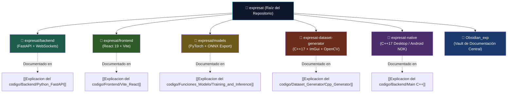

# 📂 Estructura del Repositorio y Arquitectura de Módulos — ExpresaT

> **Navegación:** [[00_INDICE_MAESTRO|🏠 Índice Maestro]] > **Estructura del Proyecto**

El repositorio de **ExpresaT** está organizado como un ecosistema multi-componente desacoplado que contiene el servidor central, clientes web modernos y tradicionales, herramientas nativas en C++ de alto rendimiento para captura de datos y un entorno nativo offline para dispositivos móviles y de escritorio.

---

## 🗺️ Mapa de Relación entre Módulos y Documentación



---

## 🗂️ Árbol Exhaustivo de Directorios

```text
expresat/
├── backend/                       # Servidor central asíncrono (FastAPI + WebSocket)
│   ├── main.py                   # Punto de entrada ASGI, ConnectionManager y lifespan
│   ├── websockets_handler.py     # Gestor de streaming de landmarks y reconexiones
│   ├── requirements.txt          # Dependencias de producción: fastapi, uvicorn, onnxruntime, numpy
│   └── requirements-train.txt    # Dependencias de investigación: torch, torchvision, scikit-learn
│
├── frontend/                     # Cliente web moderno de producción (React 19 + Vite)
│   ├── src/
│   │   ├── main.jsx              # Inicialización de React en el DOM
│   │   ├── App.jsx               # Enrutador principal (React Router 7) y providers
│   │   ├── components/           # Componentes UI reutilizables (Navbar, Footer, ThemeToggle)
│   │   ├── pages/                # Vistas: Translator.jsx, Home.jsx, Auth.jsx, Learn.jsx
│   │   ├── services/             # Integraciones: apiService.js, mediapipeEngine.js, authService.js
│   │   ├── hooks/                # Hooks personalizados de cámara e inferencia
│   │   └── styles/               # CSS modular y diseño Glassmorphism accesible
│   ├── index.html                # Documento raíz con metadatos de accesibilidad
│   ├── package.json              # Dependencias: react, vite, @supabase/supabase-js, lucide-react
│   ├── vite.config.js            # Configuración de compilación optimizada y HMR
│   └── .oxlintrc.json            # Reglas de análisis estático ultra-rápido Oxlint
│
├── frontend-legacy/              # Cliente web de referencia en JavaScript puro (Vanilla)
│   ├── index.html                # Maqueta minimalista sin herramientas de compilación
│   └── js/                       # Módulos ES6 puros (app.js, mediapipe_engine.js, api_service.js)
│
├── models/                       # Pipeline de inteligencia artificial y red recurrente
│   ├── inference_engine.py       # Wrapper de sesión ONNX Runtime, normalización y postprocesado
│   ├── train_and_export.py       # Pipeline continuo: PyTorch GRU → ONNX float32 → INT8 cuantizado
│   ├── inference.py              # Script CLI para benchmarks y validación en local
│   └── exported_model/           # Artefactos compilados listos para producción
│       ├── expresat_gru_int8.onnx      # Modelo cuantizado para producción (~4 KB grafo)
│       ├── expresat_gru_float32.onnx   # Modelo flotante original sin cuantizar
│       └── model_metadata.json         # Metadatos del modelo: etiquetas, dimensiones, versión
│
├── expresat-dataset-generator/    # Herramienta de escritorio nativa en C++17 para síntesis de datos
│   ├── CMakeLists.txt            # Configuración CMake 3.20+ (OpenCV 4/5, GLFW3, Dear ImGui)
│   ├── src/                      # Código fuente en C++ (extracción, normalización 178D, GUI ImGui)
│   ├── scripts/                  # Scripts de automatización (build.sh, setup_third_party.sh)
│   └── dataset/                  # Datasets generados en formato JSON estructurado
│
├── expresat-native/               # Entorno nativo offline para escritorio y Android
│   ├── core/                     # Motor C++ con buffers lock-free y sesiones ONNX Runtime
│   ├── desktop/                  # Aplicación de escritorio multiplataforma (Windows/Linux)
│   └── android/                  # Proyecto Gradle con puente JNI para dispositivos móviles
│
├── exported_model/               # Acceso rápido en la raíz hacia models/exported_model/
├── netlify.toml                  # Configuración de hosting CDN para frontend web
├── supabase/                     # Migraciones SQL y esquemas de base de datos PostgreSQL
└── Obsidian_exp/                 # Base de conocimiento y documentación técnica completa
    ├── 00_INDICE_MAESTRO.md      # Centro de navegación unificado
    ├── Caracteristicas.md        # Especificación técnica del modelo e IA
    ├── Flujo de datos.md         # Pipeline de datos y cálculo de latencias
    ├── Websocket.md              # Contratos de red y esquemas JSON
    ├── Deploys.md                # Guía de despliegue en producción
    ├── Plan de negocio...md      # Estrategia de producto y pricing
    ├── Skills/                   # Guías de habilidades agrupadas por especialidad
    └── Explicacion del codigo/   # Desglose exhaustivo por componente
```

---

## 🚀 Comandos Rápidos de Compilación y Ejecución

### 1. Iniciar Servidor Backend (Python)
```bash
cd expresat/backend
pip install -r requirements.txt
uvicorn main:app --host 0.0.0.0 --port 8000 --reload
```

### 2. Iniciar Frontend Web (React + Vite)
```bash
cd expresat/frontend
npm install
npm run dev
```

### 3. Compilar Generador de Datasets (C++ Nativo)
```bash
cd expresat-dataset-generator
./scripts/build.sh release
./build/release/expresat-dataset-generator
```

---

## 🤖 Asignación de Agentes y Skills Recomendadas

- **Para Tareas Arquitectónicas y Reorganización:** Invocar **`c4-architecture-c4-architecture`** y **`monorepo-architect`** (ver [[Skills/00_Matriz_General_Skills]]).
- **Para Auditoría de Scripts y Dependencias:** Invocar **`dx-optimizer`** y **`bash-pro`**.
- **Para Consulta de Módulos Específicos:** Dirigirse a los enlaces de documentación correspondientes en la columna de relación arriba.
