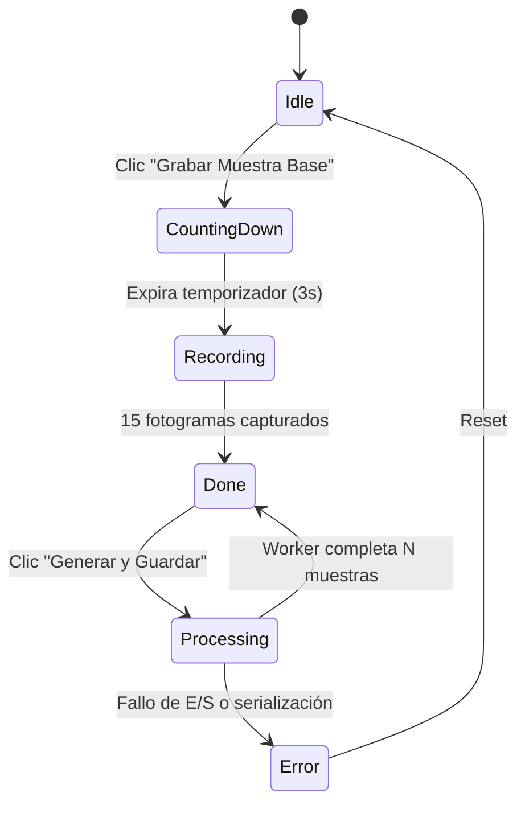

# Fase 4: Interfaz Gráfica con Dear ImGui y OpenGL

> **Navegación:** [[../../00_INDICE_MAESTRO|🏠 Índice Maestro]] > [[Cpp_Generator|🛠️ Dataset Generator]] > **Fase 4: Interfaz Gráfica ImGui**

## Arquitectura de Renderizado

La interfaz de usuario de `expresat-dataset-generator` está implementada utilizando **Dear ImGui** (modo Immediate-Mode GUI) sobre una ventana administrada por **GLFW3** y acelerada por hardware mediante un contexto **OpenGL 3.3 Core Profile**:

```text
┌────────────────────────────────────────────────────────────────────────┐
│                        GLFW Window (1280x720)                          │
├─────────────────────────┬──────────────────────────────────────────────┤
│  Panel de Control       │             Viewport de Video                │
│  (ImGui Child ~310px)   │       (Textura OpenGL 3.3 / ImGui::Image)    │
│                         │                                              │
│  [x] Upper Pose (52D)   │    ┌────────────────────────────────────┐    │
│  [x] Left Hand (63D)    │    │                                    │    │
│  [x] Right Hand (63D)   │    │      Webcam BGR + Skeleton         │    │
│  [x] Mostrar Skeleton   │    │          (Centrado 4:3)            │    │
│                         │    │                                    │    │
│  Etiqueta: [hola      ] │    │           [ 3 ] Cuenta Regresiva   │    │
│  Muestras: [500       ] │    │           ● REC Indicador          │    │
│  Cuadros:  [15        ] │    │                                    │    │
│                         │    └────────────────────────────────────┘    │
│  [ Grabar Muestra Base] │                                              │
│  [ Generar Dataset   ] │                                              │
│  Progreso: [████░░] 68% │                                              │
│  Cam FPS: 15.2          │                                              │
└─────────────────────────┴──────────────────────────────────────────────┘
```

---

## Máquina de Estados de la Aplicación (`AppState`)

Para asegurar una experiencia de usuario fluida y evitar operaciones simultáneas conflictivas, el sistema se rige por un autómata finito de estados:



1. **`AppState::Idle`**: Estado de espera. El usuario puede modificar parámetros, seleccionar partes del cuerpo y observar el video en vivo con la superposición de landmarks.
2. **`AppState::CountingDown`**: Al presionar `Grabar Muestra Base`, se activa un temporizador de 3 segundos con dígitos gigantes superpuestos en pantalla. Esto le otorga al usuario el tiempo necesario para posicionar sus manos antes de iniciar el gesto.
3. **`AppState::Recording`**: El sistema recopila exactamente los 15 fotogramas consecutivos requeridos para la seña. La interfaz muestra un indicador rojo titilante `● REC` y una barra de progreso que se llena en tiempo real. Al llegar al cuadro 15, la grabación se detiene automáticamente.
4. **`AppState::Processing`**: Se despacha la tarea de aumentación a un hilo secundario (`std::thread`). La interfaz permanece totalmente reactiva (60 FPS) mientras una barra de progreso refleja el avance de las muestras generadas.
5. **`AppState::Done`**: Los datos se han persistido en disco en formato JSON. El botón para exportar se reactiva.
6. **`AppState::Error`**: Se muestra un mensaje de advertencia visual en caso de anomalías (por ejemplo, intentar generar sin haber grabado una muestra base).

---

## Captura Asíncrona de Cámara (`CameraStream`)

La lectura de cámaras USB o integradas mediante `cv::VideoCapture` puede introducir latencias impredecibles de 10 a 60 milisegundos por fotograma debido a bloqueos del driver del sistema operativo. Si esta captura se ejecutara en el hilo principal de la interfaz, la ventana de ImGui sufriría caídas de fluidez notables.

`CameraStream` (`src/camera_stream.h` y `src/camera_stream.cpp`) aísla la lectura en un hilo independiente (`captureThread_`):

```cpp
void CameraStream::captureLoop() {
    cv::Mat frame;
    while (running_.load()) {
        if (!cap_.read(frame) || frame.empty()) {
            std::this_thread::sleep_for(std::chrono::milliseconds(5));
            continue;
        }

        // Conversión a RGB para la textura de OpenGL
        cv::Mat rgb;
        cv::cvtColor(frame, rgb, cv::COLOR_BGR2RGB);

        {
            std::lock_guard<std::mutex> lock(frameMutex_);
            latestFrame_ = frame.clone();  // Copia BGR para visión/landmarks
            uploadFrame_ = std::move(rgb); // Copia RGB para la GPU
            ++frameSeq_;
        }
    }
}
```

---

## Subida a Textura OpenGL y Renderizado

Para pintar el fotograma de la cámara en Dear ImGui:

1. Se genera un identificador de textura OpenGL en la inicialización: `glGenTextures(1, &camTexId_)`.
2. En cada iteración del bucle principal, si hay un nuevo fotograma disponible (`frameSeq_ != lastUploadSeq_`), se actualiza la memoria de la GPU mediante `glTexImage2D`:
   ```cpp
   glBindTexture(GL_TEXTURE_2D, camTexId_);
   glTexImage2D(GL_TEXTURE_2D, 0, GL_RGB,
                rgb.cols, rgb.rows, 0,
                GL_RGB, GL_UNSIGNED_BYTE, rgb.data);
   glBindTexture(GL_TEXTURE_2D, 0);
   ```
3. Se invoca el widget de imagen de Dear ImGui:
   ```cpp
   ImGui::Image((ImTextureID)(uintptr_t)camTexId_, ImVec2(texW, texH));
   ```
4. El viewport calcula automáticamente los márgenes para preservar la relación de aspecto 4:3 y centrar el video dentro del área disponible, sin importar cómo el usuario redimensione la ventana principal.

---

## Generación en Hilo Desacoplado (`std::thread`)

Cuando el usuario solicita generar 3000 muestras sintéticas, la operación involucra millones de operaciones de punto flotante y la serialización de varios megabytes en formato JSON.

Para mantener la interfaz receptiva:

```cpp
void GuiManager::startGeneration() {
    state_ = AppState::Processing;
    progress_.store(0.f);
    workerDone_.store(false);

    // Despachar el trabajo en un hilo independiente
    workerThread_ = std::thread(&GuiManager::generationWorker, this,
                                baseSequence_, recCfg_.syntheticN, recCfg_);
}

void GuiManager::generationWorker(Sequence base, int count, RecordingConfig cfg) {
    try {
        int featDim = (parts_.upperPose ? POSE_FEATURE_DIM : 0)
                    + (parts_.leftHand  ? HAND_FEATURE_DIM : 0)
                    + (parts_.rightHand ? HAND_FEATURE_DIM : 0);

        auto samples = augmenter_.generate(base, count, featDim);
        writer_.write(cfg.label, samples, cfg.sequenceLen, featDim);
        writer_.writeCombined();

        statusMsg_ = "Guardado: ./dataset/" + cfg.label + ".json";
    } catch (const std::exception& e) {
        state_ = AppState::Error;
        statusMsg_ = std::string("Error: ") + e.what();
    }
    workerDone_.store(true);
}
```

El hilo principal simplemente consulta la bandera atómica `workerDone_.load()` en cada cuadro, notificando el éxito de la operación en el momento exacto en que el hilo de fondo concluye.
