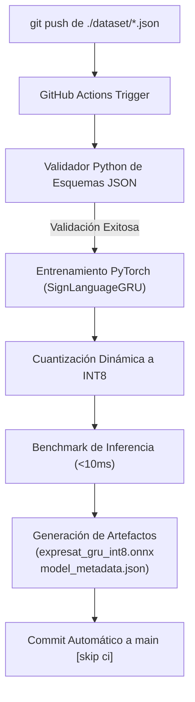

# Fase 5: Serialización JSON e Integración CI/CD

> **Navegación:** [[../../00_INDICE_MAESTRO|🏠 Índice Maestro]] > [[Cpp_Generator|🛠️ Dataset Generator]] > **Fase 5: Serialización y CI/CD**

## Formato y Esquema de Salida (`./dataset/<label>.json`)

Los datos generados por la herramienta se guardan en archivos JSON estructurados con **`nlohmann/json`**, optimizados tanto para legibilidad como para velocidad de carga en Python:

```json
{
  "label": "hola",
  "num_samples": 500,
  "sequence_length": 15,
  "feature_dim": 178,
  "data": [
    [
      [0.0124, -0.0451, 0.0032, 0.99, ...], // Frame 1 (178 floats)
      [0.0118, -0.0442, 0.0029, 0.98, ...], // Frame 2
      // ... 15 fotogramas
    ],
    // ... repetido num_samples veces
  ]
}
```

### Campos del Esquema

| Campo | Tipo | Descripción |
|---|---|---|
| `label` | `string` | Identificador de la seña (ej. `"hola"`, `"gracias"`). |
| `num_samples` | `integer` | Número total de secuencias contenidas en el archivo. |
| `sequence_length` | `integer` | Cantidad de fotogramas continuos por secuencia (por defecto: 15). |
| `feature_dim` | `integer` | Dimensionalidad de cada fotograma (178 para Pose Superior + Dos Manos). |
| `data` | `float[][][]` | Tensor 3D con forma $(\text{muestras}, \text{frames}, \text{features})$. |

---

## El Escritor de Datasets (`DatasetWriter`)

La clase `DatasetWriter` (`src/dataset_writer.h` y `src/dataset_writer.cpp`) gestiona dos modos de persistencia en disco:

1. **Escritura Individual por Etiqueta (`write`)**:
   Crea o sobreescribe `./dataset/<label>.json`. Esto permite que un equipo capture nuevas palabras de forma modular y asíncrona, sin riesgo de sobreescribir las señas de otros colaboradores en git.
2. **Fusión Agregada (`writeCombined`)**:
   Lee automáticamente todos los archivos JSON del directorio `./dataset/` y genera un archivo unificado `./dataset/dataset.json`. Este archivo compilado es consumido directamente por scripts de entrenamiento masivo.

---

## Compatibilidad con `train_and_export.py`

El formato JSON exportado se sincroniza de forma transparente con la arquitectura del modelo de aprendizaje profundo del proyecto `expresat`:

- **Arquitectura**: `SignLanguageGRU` (1 capa GRU, 64 unidades ocultas, clasificador compacto de 64 → 32 → $N$ clases con Dropout al 30%).
- **Forma de entrada esperada**: `(batch_size, 15, 178)`.
- **Preprocesamiento**: Mapeo idéntico con normalización `shoulder_relative`.

---

## Pipeline de Integración Continua (GitHub Actions)

El archivo `.github/workflows/train_model.yml` implementa un flujo completo de **MLOps automatizado**:



### Fases del Flujo de Trabajo en GitHub Actions

1. **Disparador Condicional**:
   Se activa únicamente cuando se detectan cambios en la ruta `expresat-dataset-generator/dataset/**.json`, o bajo demanda manual mediante `workflow_dispatch`.
2. **Validación de Integridad**:
   Un script embebido en Python examina cada JSON del directorio:
   - Verifica la presencia obligatoria de `label` y `data`.
   - Comprueba que la dimensión `feature_dim` sea consistente (178).
   - Extrae la lista de clases dinámicamente y la transfiere al entorno de entrenamiento.
3. **Entrenamiento y Cuantización**:
   Se invoca el script de producción:
   ```bash
   python expresat/models/train_and_export.py \
     --epochs 50 \
     --output ./exported_model \
     --labels $LABELS
   ```
4. **Verificación ONNX Runtime (Sanity Check)**:
   Se crea una sesión de inferencia en CPU y se evalúa un tensor simulado para certificar que el archivo `.onnx` es funcional antes de desplegarlo.
5. **Publicación y Despliegue**:
   - Los artefactos finales (`expresat_gru_int8.onnx` y `model_metadata.json`) se publican como artefactos de GitHub con 30 días de retención.
   - Si la ejecución ocurrió en la rama `main`, la acción realiza automáticamente un `git commit` y `git push` con los nuevos pesos del modelo, permitiendo que el backend de FastAPI y el frontend consuman la versión más reciente sin intervención manual.
