# 🛠️ Generador de Datasets C++ (`expresat-dataset-generator`)

> **Navegación:** [[../../00_INDICE_MAESTRO|🏠 Índice Maestro]] > **Explicación del Código** > **Generador de Datasets C++**

---

## 1. Visión General y Propósito

El **`expresat-dataset-generator`** es una aplicación nativa de escritorio de alto rendimiento desarrollada en **C++17** con interfaz gráfica en **Dear ImGui**, aceleración gráfica **OpenGL 3.3 / GLFW**, y visión por computadora con **OpenCV 4/5**.

Su objetivo primordial dentro del ecosistema **ExpresaT** es resolver el cuello de botella más crítico en el aprendizaje profundo para Lengua de Señas: **la captura y recolección de datos reales de landmarks y la síntesis a escala de secuencias de entrenamiento uniformes**.

```mermaid
flowchart LR
    A["Webcam / Cámara\n(OpenCV cv::VideoCapture)"] --> B["Extracción & Normalización\n(MediapipeExtractor 178D)"]
    B --> C["Grabación Secuencia Base\n(15 frames = 1 seg)"]
    C --> D["Motor de Aumentación\n(DataAugmenter en std::thread)"]
    D --> E["Serialización JSON\n(DatasetWriter ./dataset/*.json)"]
    E --> F["GitHub Actions CI/CD\n(train_and_export.py)"]
    F --> G["Modelo Desplegado\n(expresat_gru_int8.onnx)"]

    style A fill:#2d5a27,color:#fff
    style B fill:#1a3a6b,color:#fff
    style C fill:#6b5a1a,color:#fff
    style D fill:#6b2d1a,color:#fff
    style E fill:#4a2d6b,color:#fff
    style F fill:#2b4a6b,color:#fff
    style G fill:#1d5b4a,color:#fff
```

---

## 2. Módulos Técnicos Detallados

La documentación técnica detallada está dividida en las siguientes guías modulares:

1. **[[01_Arquitectura_y_Compilacion]]**: Sistema de compilación CMake 3.20+, C++17, dependencias vendored/FetchContent, scripts de automatización (`build.sh`, `setup_third_party.sh`) y perfiles de compilación (`debug`, `release`, `mediapipe`).
2. **[[02_Extraccion_y_Normalizacion]]**: Layout del vector plano de 178 dimensiones, formulación matemática de la normalización relativa al centro de hombros ($C_{shoulder}$), modo STUB senoidal y renderizado de skeleton visual sobre el fotograma.
3. **[[03_Motor_Aumentacion_Sintetica]]**: Motor estocástico en `std::thread`, transformaciones espaciales (Ruido Gaussiano, Escalado, Rotación 2D XY) y temporales (Jittering/Warping temporal con interpolación lineal).
4. **[[04_Interfaz_Grafica_ImGui]]**: Arquitectura de Dear ImGui + GLFW3 + OpenGL 3.3, subprocesos desacoplados (`CameraStream` y worker de generación), máquina de estados interactiva (Idle, Cuenta regresiva 3-2-1, Grabación, Progreso reactivo).
5. **[[05_Serializacion_JSON_y_CICD]]**: Estructura JSON por etiqueta (`./dataset/<label>.json`), archivo compilado `dataset.json`, y pipeline de integración continua en GitHub Actions (`train_model.yml`) que entrena el modelo PyTorch `SignLanguageGRU` y exporta a ONNX INT8.

---

## 3. Comparativa: Captura Tradicional vs. C++ Dataset Generator

| Criterio | Pipeline Tradicional (Python / Web) | expresat-dataset-generator (C++ Nativo) |
|---|---|---|
| **Latencia de Captura** | Variable (15–40 ms por frame por sobrecarga de GIL e IPC) | Determinista (~1–3 ms en hilo dedicado C++) |
| **Normalización** | Post-procesamiento asíncrono en scripts | En tiempo real en memoria antes de la serialización |
| **Generación de Variantes** | Lenta (bucles de CPU en Python) | Instantánea (cálculo matricial SIMD en `std::thread`) |
| **Sincronización de Longitud** | Requiere padding o truncamiento dinámico | Exactamente 15 frames garantizados por secuencia |
| **Integración CI/CD** | Requiere subir videos pesados al repositorio | Sube únicamente vectores normalizados en JSON ligeros |

---

## 🤖 Asignación de Agentes y Skills Recomendadas

- **Para Compilación y Optimización C++:** Invocar **`cpp-pro`** (ver [[../../Skills/Backend_APIs_y_Sistemas]]).
- **Para Calidad de Datasets y Validación:** Invocar **`data-engineering-data-pipeline`** y **`data-quality-frameworks`** (ver [[../../Skills/MachineLearning_y_Vision]]).
- **Para la Interfaz Gráfica con Dear ImGui:** Invocar **`ui-ux-designer`** (ver [[../../Skills/UI_UX_y_Frontend]]).
