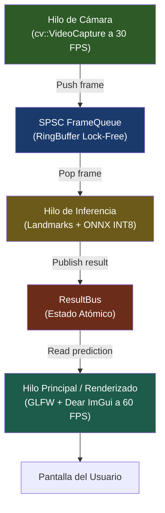

# 🖥️ Explicación del Código: Frontend Nativo Multiplataforma (C++ / ImGui / Android)

> **Navegación:** [[../00_INDICE_MAESTRO|🏠 Índice Maestro]] > **Explicación del Código** > **Frontend Nativo**

---

## 1. Propósito General y Arquitectura

El frontend de **ExpresaT** cuenta con una vertiente de alto rendimiento implementada como una **aplicación nativa en C++17**. Esta solución prescinde del intermediario del navegador web y de la conexión de red WebSocket, ejecutando la captura de video y la inferencia ONNX en el mismo proceso para alcanzar latencias ultra-bajas con nulo retraso de red.

### Pila Tecnológica:
- **Escritorio (Windows / Linux):** C++17, [Dear ImGui](https://github.com/ocornut/imgui), GLFW 3.3, OpenGL 3.3.
- **Móvil (Android):** C++ NDK, JNI (Java Native Interface), Android CameraX / SurfaceView.
- **Captura Óptica:** OpenCV (`cv::VideoCapture`).

---

## 2. Organización de Archivos en el Repositorio

El código fuente de esta variante reside en `expresat-native/`:

```text
expresat-native/
├── desktop/                      # Target de escritorio (Windows / Linux)
│   ├── main.cpp                  # Punto de entrada, ventana GLFW y loop ImGui
│   └── CMakeLists.txt            # Reglas de construcción para la app de escritorio
├── android/                      # Target móvil para Android
│   ├── app/build.gradle          # Configuración de compilación con Gradle y NDK
│   └── app/src/main/
│       ├── cpp/android_main.cpp  # Puente JNI con el motor nativo de inferencia
│       └── java/.../MainActivity.java # Interfaz y ciclo de vida en Android
└── core/                         # Motor común compartido (InferenceThread, FrameQueue)
```

---

## 3. Componentes Clave en Escritorio



### Bucle Principal ImGui + GLFW
1. **Inicialización:** GLFW inicializa el contexto de renderizado OpenGL 3.3 y enlaza Dear ImGui.
2. **Hilo de Cámara Dedicado:** Un `std::thread` sondea continuamente fotogramas de la webcam mediante `cv::VideoCapture`, insertándolos de forma no bloqueante en una cola `FrameQueue`.
3. **Hilo de Inferencia Concurrente:** Extrae los fotogramas de la cola, gestiona la ventana circular de 15 frames, ejecuta el modelo ONNX y publica la predicción en el `ResultBus`.
4. **Bucle de Renderizado (Main Thread):**
   - Procesa los eventos de ventana (teclado/ratón).
   - Transforma el fotograma `cv::Mat` a una textura OpenGL.
   - Lee el resultado atómico del `ResultBus` y dibuja el HUD sobre el video (etiqueta detectada, barra de confianza y gráficos de FPS).

### Comunicación Lock-Free entre Hilos
Para garantizar que la interfaz mantenga 60 FPS estables sin interrupciones del hilo de inferencia:
- **`FrameQueue<N>`:** Búfer circular Single-Producer Single-Consumer (SPSC) sin bloqueos por mutex.
- **`ResultBus`:** Estructura atómica protegida contra condiciones de carrera que desacopla la frecuencia de la inferencia (~15 Hz) del repintado de la pantalla (60 Hz).

---

## 4. Integración Móvil en Android (JNI)

En Android, la capa visual aprovecha las vistas nativas del sistema operativo, mientras que el procesamiento pesado de visión e inferencia ONNX se delega a las bibliotecas compartidas C++ (`.so`) compiladas mediante el **Android NDK** a través de `android_main.cpp`.

---

## 🤖 Asignación de Agentes y Skills Recomendadas

- **Para Desarrollo C++ y Lock-Free:** Invocar **`cpp-pro`** y **`memory-safety-patterns`** (ver [[../Skills/Backend_APIs_y_Sistemas]]).
- **Para Compilación y Depuración Android:** Invocar **`android-cli`** (ver [[../Skills/DevOps_CI_CD_y_Despliegue]]).
- **Para Ergonomía Visual y HUD:** Invocar **`ui-ux-designer`** (ver [[../Skills/UI_UX_y_Frontend]]).