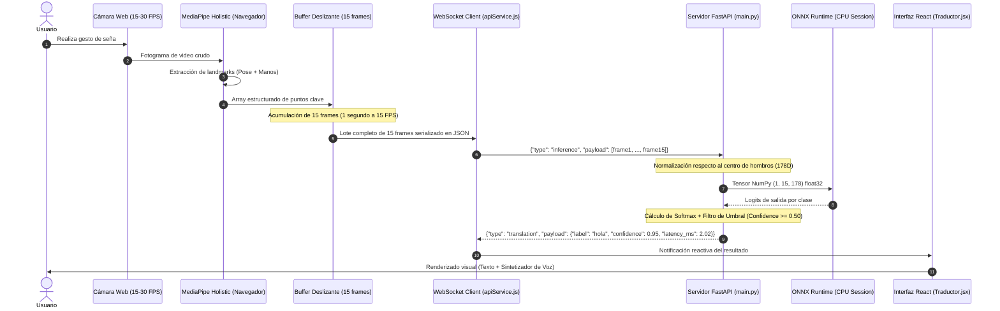

# 🔄 Flujo de Datos y Pipeline de Procesamiento — ExpresaT

> **Navegación:** [[00_INDICE_MAESTRO|🏠 Índice Maestro]] > **Flujo de Datos**

Este documento detalla el ciclo de vida completo de la información desde que el sensor óptico (cámara web) captura la escena hasta que la predicción textual y audible de la lengua de señas es desplegada en pantalla.

---

## 🛰️ Diagrama de Secuencia de Flujo de Datos (Arquitectura Web)

---

## ⚡ Pipeline Nativo Local (C++ / Edge In-Device)

En la variante **`expresat-native`**, el flujo de datos no atraviesa la pila de red ni protocolos HTTP/WebSocket, garantizando latencias inferiores a **3 ms** y funcionamiento sin conexión a Internet (*offline-first*):

```mermaid
flowchart LR
    A["Cámara\n(cv::VideoCapture)"] -->|"cv::Mat crudo"| B["SPSC FrameQueue\n(Lock-Free RingBuffer)"]
    B -->|"Wait-Free Pop"| C["Inference Thread\n(MediaPipe Tasks C++)"]
    C -->|"178D Landmarks"| D["Circular Buffer\n(15 frames continuos)"]
    D -->|"Flatten Tensor [1, 15, 178]"| E["ONNX Runtime C++\n(expresat_gru_int8.onnx)"]
    E -->|"Softmax & Top-5"| F["ResultBus\n(Atomic State)"]
    F -->|"Lectura asíncrona"| G["Dear ImGui / OpenGL\n(Render Loop 60 FPS)"]

    style A fill:#2d5a27,color:#fff
    style B fill:#1a3a6b,color:#fff
    style C fill:#6b5a1a,color:#fff
    style D fill:#6b2d1a,color:#fff
    style E fill:#4a2d6b,color:#fff
    style F fill:#2b4a6b,color:#fff
    style G fill:#1d5b4a,color:#fff
```

---

## 📐 Topología Matemática del Vector de Características (178D)

Cada fotograma individual dentro de la secuencia temporal de 15 frames es procesado y normalizado para transformarse en un vector unidimensional de **178 componentes flotantes (`float32`)**:

| Región Anatómica | Puntos MediaPipe | Coordenadas por Punto | Total Características |
|---|---|---|---|
| **Upper Pose** | Índices `0` (nariz) y `11` a `22` (hombros, codos, muñecas) | $x, y, z, \text{visibility}$ (4D) | $13 \times 4 =$ **52** |
| **Mano Izquierda** | Índices `0` a `20` (21 articulaciones completas) | $x, y, z$ (3D) | $21 \times 3 =$ **63** |
| **Mano Derecha** | Índices `0` a `20` (21 articulaciones completas) | $x, y, z$ (3D) | $21 \times 3 =$ **63** |
| **TOTAL POR FOTOGRAMA** | | | **178 dimensiones** |
| **SECUENCIA COMPLETA** | 15 fotogramas temporales concatenados | | $15 \times 178 =$ **2,670 flotantes** |

### Algoritmo de Normalización Relativa a Hombros
Para garantizar invariancia ante la distancia del usuario a la cámara o su posición dentro del encuadre:

1. **Centro de Referencia ($C_{shoulder}$):**
   $$C_x = \frac{x_{hombro\_izq} + x_{hombro\_der}}{2}, \quad C_y = \frac{y_{hombro\_izq} + y_{hombro\_der}}{2}$$

2. **Escala Inter-humeral ($D_{shoulder}$):**
   $$D = \sqrt{(x_{hombro\_der} - x_{hombro\_izq})^2 + (y_{hombro\_der} - y_{hombro\_izq})^2} + \epsilon$$

3. **Transformación:**
   $$\vec{p}_{normalizado} = \frac{\vec{p}_{crudo} - C_{shoulder}}{D_{shoulder}}$$

---

## ⏱️ Presupuesto de Latencias (Latency Budget)

| Etapa | Plataforma Web (FastAPI + React) | Plataforma Nativa C++ (Desktop / Android) |
|---|---|---|
| Captura de Video | ~16 ms (60 FPS) / ~33 ms (30 FPS) | ~16 ms (hilo independiente) |
| Extracción MediaPipe | ~15–25 ms (MediaPipe JS en Web Worker) | ~8–12 ms (MediaPipe C++ Tasks) |
| Serialización & Buffer | < 1 ms | 0.05 ms (Memoria contigua) |
| Transporte de Red (WebSocket) | ~30–60 ms (dependiente del RTT de red) | **0 ms** (Memoria compartida / IPC lock-free) |
| Inferencia ONNX (INT8 CPU) | **2.02 ms** | **1.85 ms** |
| Post-procesado (Softmax/Filtro) | < 0.1 ms | < 0.05 ms |
| **Latencia Total de Respuesta** | **~65–100 ms** (Percepción instantánea) | **~10–18 ms** (Tiempo real estricto) |

---

## 🤖 Asignación de Agentes y Skills Recomendadas

Al trabajar en la optimización o depuración del flujo de datos, utiliza las siguientes skills:

- **Para Inferencia y Normalización:** Activa la skill **`ml-engineer`** (en `~/.gemini/config/skills/ml-engineer/`) para asegurar la estabilidad numérica de los tensores y la concordancia con `inference_engine.py`.
- **Para Concurrencia y Sockets:** Activa la skill **`fastapi-pro`** y **`async-python-patterns`** (en `~/.gemini/config/skills/fastapi-pro/`) para verificar que el bucle asíncrono no se bloquee durante la deserialización de lotes JSON.
- **Para Lock-Free en C++:** Activa la skill **`cpp-pro`** y **`memory-safety-patterns`** para inspeccionar la integridad de `frame_queue.h`.
- **Documentación de Referencia en Skills:** Consulta [[Skills/MachineLearning_y_Vision]] y [[Skills/Backend_APIs_y_Sistemas]].