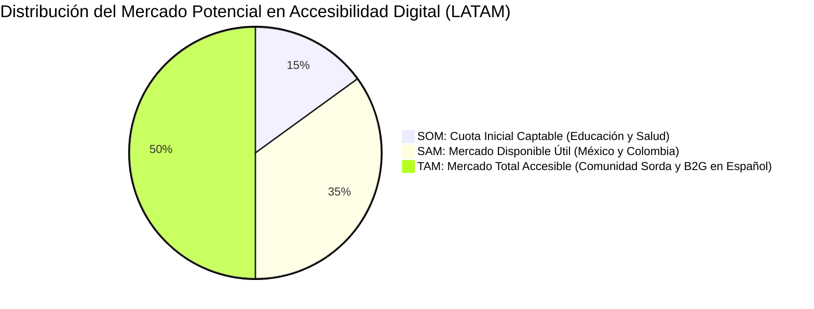
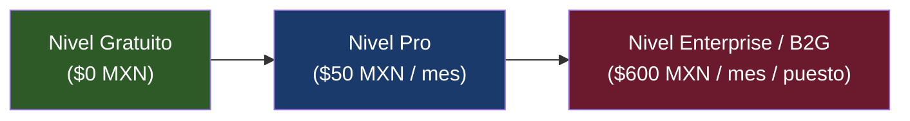

# 📈 Plan de Negocio y Estrategia de Producto — ExpresaT

> **Navegación:** [[00_INDICE_MAESTRO|🏠 Índice Maestro]] > **Plan de Negocio de EXPRESAT**

---

## 1. Resumen Ejecutivo y Misión

**ExpresaT** nace con la misión de derribar las barreras de comunicación que aíslan a más de **70 millones de personas sordas** en el mundo (con más de 2.3 millones en México y Centroamérica con dificultades auditivas o del habla).

A diferencia de las soluciones propietarias monolíticas que dependen de la nube y de costosas GPUs para visión artificial, **ExpresaT** democratiza la accesibilidad mediante un modelo **Open-Core** y una arquitectura ultra-eficiente en CPU (latencia de ~2 ms con modelos cuantizados ONNX INT8 de tan solo 4 KB), permitiendo su despliegue tanto en terminales móviles de bajo coste como en centros de atención pública.

---

## 2. Filosofía y Modelo "Open-Core"

El núcleo de la tecnología es de acceso abierto:
- **Código Abierto (Community Edition):** Los modelos base, el generador de datasets en C++ (`expresat-dataset-generator`), la aplicación nativa de escritorio y el cliente web básico son y seguirán siendo gratuitos y libres. Esto fomenta que la comunidad de personas sordas, educadores e investigadores contribuyan señas regionales, validen la semántica y reporten mejoras ergonómicas.
- **Servicios de Valor Añadido (Commercial Tier):** Se monetiza mediante el mantenimiento de servidores en la nube de alta disponibilidad, APIs de traducción para plataformas de terceros, sincronización multi-dispositivo y soporte institucional para administraciones públicas y corporativos.

---

## 3. Análisis de Mercado (TAM / SAM / SOM)

1. **TAM (Total Addressable Market):** 
   - Más de **23 millones** de hispanohablantes con discapacidad auditiva o familiares directos, más un mercado de software de accesibilidad valorado en más de **$32,000 millones de USD** a nivel global.
2. **SAM (Serviceable Addressable Market):** 
   - Instituciones públicas, universidades, colegios de educación especial, hospitales y centros de atención telefónica/presencial en México, Colombia y España (~$45 millones de USD anuales en licitaciones de inclusión social).
3. **SOM (Serviceable Obtainable Market):** 
   - Captación inicial de 100 escuelas primarias/secundarias y 15 entidades de salud pública en México durante los primeros 24 meses (~$450,000 USD anuales).

---

## 4. Segmentos de Clientes y Propuesta de Valor

| Segmento | Necesidad Principal | Propuesta de Valor de ExpresaT |
|---|---|---|
| **Usuarios Finales y Familias** | Comunicación fluida diaria en el hogar y aprendizaje continuo. | Aplicación accesible sin necesidad de computadoras con tarjetas gráficas dedicadas; privacidad total mediante procesamiento local en el dispositivo. |
| **Educación Pública y Universidades** | Integración de alumnos sordos en aulas convencionales. | Traducción bidireccional en tiempo real para proyectores de clase o tablets escolares a bajo coste de suscripción. |
| **Sector Salud y Hospitales (B2B/B2G)** | Triaje médico de emergencia con pacientes sordos sin intérprete presente. | Terminal nativa en mostradores de urgencias con disponibilidad 24/7 y sin tiempos de espera. |
| **Desarrolladores y Plataformas de Video** | Añadir subtítulos de lengua de señas a plataformas como Zoom, Teams o YouTube. | API WebSocket de ultra-baja latencia con SDKs en JavaScript, Python y C++. |

---

## 5. Estructura de Precios y Niveles de Servicio

Los precios están estructurados en **Pesos Mexicanos (MXN)** con paridad aproximada en dólares (USD) para facilitar la adopción regional:

### Detalle de Niveles de Suscripción:

1. **Nivel Comunitario (Gratuito - $0 MXN):**
   - Descarga gratuita del binario nativo de escritorio (`expresat-native`).
   - Inferencia 100% local e ilimitada en el hardware del usuario.
   - Vocabulario estándar de señas de uso frecuente.
   - Sin soporte SLA comercial (asistencia comunitaria en GitHub).

2. **Nivel Pro ($50 MXN / mes — aprox. $2.75 USD):**
   - Acceso completo a la plataforma web desde cualquier navegador sin instalación.
   - Inferencia procesada en servidores WebSocket en la nube de alta velocidad.
   - Módulo de síntesis de voz natural para verbalizar la traducción en altavoces del dispositivo.
   - Historial personal de aprendizaje y glosarios interactivos sincronizados con Supabase.

3. **Nivel Enterprise / B2B / B2G ($600 MXN / puesto / mes — aprox. $33 USD):**
   - Despliegue en terminales dedicadas para mostradores de atención ciudadana, bancos o clínicas.
   - SLA garantizado del 99.9% de disponibilidad en la API WebSocket.
   - Personalización del vocabulario con jerga técnica (médica, jurídica o administrativa local).
   - Acceso a métricas anonimizadas de uso, satisfacción y tiempos de resolución de atención.
   - Facturación empresarial formal y cumplimiento estricto con normativas de protección de datos.

4. **API para Desarrolladores:**
   - Primeras 10,000 inferencias mensuales gratuitas.
   - $1.50 MXN por cada 1,000 llamadas de inferencia posteriores.

---

## 6. Economía Unitaria y Costes Operativos

Gracias a la optimización con ONNX Runtime CPU e INT8:
- **Consumo de Memoria por Instancia:** < 100 MB RAM (permite desplegar el contenedor en instancias micro de $5 a $10 USD/mes como Fly.io o Render).
- **Rendimiento de Concurrencia:** Una sola CPU de 2 núcleos puede atender hasta 80 clientes simultáneos transmitiendo secuencias por WebSocket.
- **Coste de Inferencia por Usuario Activo:** Menos de $0.002 MXN por hora de traducción activa continua, permitiendo un margen bruto superior al **88%** en las suscripciones Pro y Enterprise.

---

## 7. Privacidad y Cumplimiento Normativo (Legal)

- **Tratamiento de Datos Biométricos:** La cámara web analiza puntos geométricos en tiempo real en la memoria volátil del navegador o de la app. **Ningún fotograma de video o imagen facial es jamás grabado, almacenado ni transmitido a servidores remotos**.
- **Regulaciones:**
  - Cumplimiento de la **Ley General para la Inclusión de las Personas con Discapacidad (México)**.
  - Conformidad con principios de privacidad por diseño (**GDPR** en la Unión Europea y **LFPDPPP** en México).

---

## 🤖 Asignación de Agentes y Skills Recomendadas

Para evolucionar la estrategia de negocio o presentar propuestas de financiamiento:
- **Especialistas en Negocio:** Utiliza las skills de [[Skills/Estrategia_Producto_y_Negocio]]:
  - `startup-business-analyst-business-case` para redactar pitch decks e informes para inversores.
  - `startup-business-analyst-financial-projections` para actualizar hojas de balance y cash-flow.
  - `competitive-landscape` para vigilar competidores de visión artificial.
- **Especialistas Legales:** Activa `legal-advisor` y `gdpr-data-handling` para auditar la política de privacidad de la cámara web.
- **Especialistas en Cobro:** Activa `billing-automation` y `stripe-integration` para codificar la pasarela de pagos.