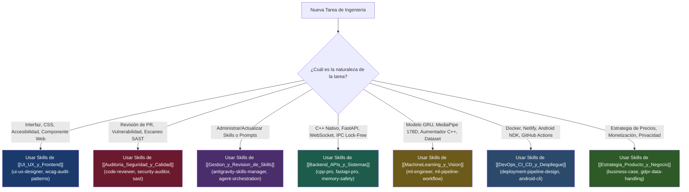

# 🧭 Matriz General de Skills y Capacidades de Agentes — ExpresaT

> [!NOTE]
> Esta matriz centraliza el catálogo de **skills instaladas** en el entorno (`~/.gemini/config/skills/` y plugins). Proporciona a los agentes de IA un mapa claro de decisión para saber exactamente qué skill activar según el tipo de tarea a ejecutar en el repositorio **ExpresaT**.

---

## 🗂️ Categorías Especializadas (Carpetas de Skills)

Navega a cada guía de especialidad para consultar la lista exhaustiva de comandos, configuraciones y modos de invocación:

| Carpeta / Dominio | Especialidad | Skills Principales Destacadas |
|---|---|---|
| **[[UI_UX_y_Frontend]]** | Diseño de interfaces, accesibilidad (a11y/WCAG), React 19, Tailwind, maquetación y validación visual. | `ui-ux-designer`, `ui-visual-validator`, `tailwind-design-system`, `wcag-audit-patterns`, `a11y-debugging`, `react-modernization`, `react-state-management` |
| **[[Auditoria_Seguridad_y_Calidad]]** | Revisión de código, auditoría estática SAST, prevención XSS/Inyección, threat modeling STRIDE y gestión de secretos. | `code-reviewer`, `code-review-excellence`, `code-review-ai-ai-review`, `security-auditor`, `backend-security-coder`, `frontend-security-coder`, `mobile-security-coder`, `sast-configuration` |
| **[[Gestion_y_Revision_de_Skills]]** | Descubrimiento, instalación, benchmarking, auditoría y creación de nuevas habilidades para agentes. | `antigravity-skills-manager`, `agent-orchestration-improve-agent`, `agent-orchestration-multi-agent-optimize`, `workflow-skill-creator`, `prompt-engineering-patterns`, `dx-optimizer` |
| **[[Backend_APIs_y_Sistemas]]** | Concurrencia C++17, memoria segura, FastAPI asíncrono, WebSockets en tiempo real, lock-free ringbuffers. | `cpp-pro`, `c-pro`, `fastapi-pro`, `fastapi-templates`, `async-python-patterns`, `python-performance-optimization`, `memory-safety-patterns`, `api-design-principles` |
| **[[MachineLearning_y_Vision]]** | MediaPipe Holistic, PyTorch GRU, ONNX Runtime INT8, aumentación estocástica y datasets de señas. | `ml-engineer`, `mlops-engineer`, `machine-learning-ops-ml-pipeline`, `ml-pipeline-workflow`, `data-engineering-data-pipeline`, `data-quality-frameworks` |
| **[[DevOps_CI_CD_y_Despliegue]]** | Docker, Netlify, Supabase, CMake, Android NDK/Gradle, GitHub Actions CI/CD y observabilidad. | `deployment-pipeline-design`, `github-actions-templates`, `android-cli`, `deployment-validation-config-validate`, `devops-troubleshooter`, `prometheus-configuration`, `grafana-dashboards` |
| **[[Estrategia_Producto_y_Negocio]]** | Modelo Open-Core, pricing B2B/B2G, compliance legal/GDPR, Stripe billing y métricas de tracción. | `startup-business-analyst-business-case`, `startup-business-analyst-financial-projections`, `competitive-landscape`, `business-analyst`, `legal-advisor`, `gdpr-data-handling`, `billing-automation` |

---

## 🤖 Guía de Decisión Rápida para Agentes Autónomos

---

## 🔍 Localización de Archivos de Skills en el Entorno Local

Todas las skills operan desde el filesystem local del agente en:
- Directorio global de skills: `~/.gemini/config/skills/<skill-name>/SKILL.md`
- Plugins de Android: `~/.gemini/config/plugins/android-cli-plugin/skills/SKILL.md`
- Plugins de Chrome DevTools: `~/.gemini/config/plugins/chrome-devtools-plugin/skills/`
- Plugins de Firebase: `~/.gemini/config/plugins/firebase/skills/`

> [!IMPORTANT]
> Antes de ejecutar tareas complejas sobre cualquier subsistema, el agente debe inspeccionar el archivo `SKILL.md` correspondiente usando `view_file` para internalizar las mejores prácticas y patrones defensivos de dicha disciplina.
