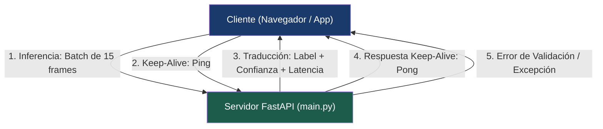

# 📡 Protocolo WebSocket y Streaming en Tiempo Real — ExpresaT

> **Navegación:** [[00_INDICE_MAESTRO|🏠 Índice Maestro]] > **Protocolo WebSocket**

La comunicación en tiempo real entre el cliente de captura (navegador o cliente ligero) y el motor de inferencia centralizado se realiza mediante el protocolo **WebSocket (RFC 6455)**, diseñado para minimizar la latencia de transporte y posibilitar un intercambio continuo de coordenadas corporales.

---

## 1. Puntos de Conexión (Endpoints)

| Endpoint | Estado | Descripción |
|---|---|---|
| `/ws/translate` | **Activo (Producción)** | Endpoint principal para inferencia en tiempo real. Admite modo por lotes (*Batch Mode*) y modo streaming clásico. |
| `/ws` | *Legacy (Compatibilidad)* | Redirecciona internamente hacia `/ws/translate` para soportar clientes antiguos. |

### Handshake y Autenticación con Supabase
La conexión se establece suministrando opcionalmente el token de acceso JWT provisto por Supabase como parámetro en la URL:

```
wss://api.expresat.com/ws/translate?token=<SUPABASE_JWT_ACCESS_TOKEN>
```

- En modo desarrollo (`ENVIRONMENT=development`), la función `verify_supabase_token` acepta cualquier token.
- En modo producción, el servidor valida la firma criptográfica del JWT contra el secreto de Supabase antes de autorizar el socket.

---

## 2. Contratos de Mensajería y Esquemas JSON



### A. Mensajes del Cliente hacia el Servidor

#### 1. Modo por Lotes (Batch Mode — Recomendado)
Envía un bloque temporal consolidado de 15 fotogramas contiguos (equivalente a 1 segundo de movimiento a 15 FPS):
```json
{
  "type": "inference",
  "payload": [
    {
      "pose": [{"x": 0.5, "y": 0.2, "z": -0.1, "visibility": 0.99}, "... 13 puntos"],
      "leftHand": [{"x": 0.4, "y": 0.6, "z": 0.05}, "... 21 puntos"],
      "rightHand": [{"x": 0.6, "y": 0.6, "z": 0.05}, "... 21 puntos"]
    }
    // ... 15 elementos en total
  ]
}
```

#### 2. Modo Flujo Continuo (Stream Mode — Compatibilidad hacia atrás)
Envía un único fotograma; el servidor acumula internamente los frames en una cola por cliente:
```json
{
  "type": "inference",
  "payload": {
    "pose": [...],
    "leftHand": [...],
    "rightHand": [...]
  }
}
```

#### 3. Mensaje de Control (Ping / Heartbeat)
Permite mantener la conexión activa ante proxies inversos con timeouts agresivos:
```json
{
  "type": "ping"
}
```

---

### B. Mensajes del Servidor hacia el Cliente

#### 1. Resultado de Traducción (`translation`)
Emitido cuando la inferencia se completa y supera el umbral de confianza configurado (`confidence >= CONFIDENCE_THRESHOLD`):
```json
{
  "type": "translation",
  "payload": {
    "label": "hola",
    "confidence": 0.952,
    "latency_ms": 2.02,
    "all_probabilities": {
      "hola": 0.952,
      "gracias": 0.031,
      "adios": 0.012,
      "por_favor": 0.003,
      "si": 0.002
    }
  }
}
```

#### 2. Respuesta de Control (`pong`)
```json
{
  "type": "pong"
}
```

#### 3. Mensaje de Error (`error`)
Emitido ante datos mal formados o excepciones internas del modelo:
```json
{
  "type": "error",
  "payload": "Payload inválido: se esperaban 15 frames para la inferencia."
}
```

---

## 3. Implementación del Administrador de Conexiones (`ConnectionManager`)

En `expresat/backend/main.py`, la gestión de estado de los sockets está encapsulada en una clase con control de concurrencia:

```python
class ConnectionManager:
    def __init__(self):
        self.active_connections: list[WebSocket] = []

    async def connect(self, websocket: WebSocket):
        await websocket.accept()
        self.active_connections.append(websocket)

    def disconnect(self, websocket: WebSocket):
        if websocket in self.active_connections:
            self.active_connections.remove(websocket)

    async def send_personal_message(self, message: dict, websocket: WebSocket):
        await websocket.send_json(message)

    async def broadcast(self, message: dict):
        for connection in self.active_connections:
            await connection.send_json(message)
```

### Inferencia No Bloqueante en Hilo Desacoplado
Para evitar congelar el bucle de eventos (`asyncio event loop`) al procesar tensores NumPy y sesiones de ONNX Runtime:

```python
async def run_inference_async(engine, raw_frames):
    # Offload de CPU bound task a un thread pool desacoplado
    return await asyncio.to_thread(engine.predict, raw_frames)
```

---

## 4. Consideraciones Operativas y de Red

1. **Configuración de Proxy Inverso (Nginx):**
   Para evitar cierres abruptos por timeout tras periodos breves de silencio gestual:
   ```nginx
   proxy_set_header Upgrade $http_upgrade;
   proxy_set_header Connection "upgrade";
   proxy_read_timeout 3600s;
   proxy_send_timeout 3600s;
   ```
2. **Reconexión Automática en el Cliente (`apiService.js`):**
   El cliente implementa reconexión exponencial con retroceso (*exponential backoff* con jitter) en caso de caída temporal del enlace de red.
3. **Alternativa Nativa (IPC Sin Red):**
   En la aplicación C++ `expresat-native`, este protocolo de red es reemplazado por colas circulares en memoria (*lock-free SPSC*), eliminando el protocolo WebSocket y reduciendo el transporte a 0 milisegundos.

---

## 🤖 Asignación de Agentes y Skills Recomendadas

- **Para Desarrollo y Optimización de Sockets:** Invocar **`fastapi-pro`** y **`async-python-patterns`** (ver [[Skills/Backend_APIs_y_Sistemas]]).
- **Para Auditoría de Vulnerabilidades y DoS:** Invocar **`backend-security-coder`** y **`security-auditor`** (ver [[Skills/Auditoria_Seguridad_y_Calidad]]) para asegurar que se restrinja el tamaño máximo de los mensajes JSON entrantes y se evite la saturación de memoria.
- **Para Simulación y Pruebas de Carga:** Invocar **`api-testing-observability-api-mock`**.